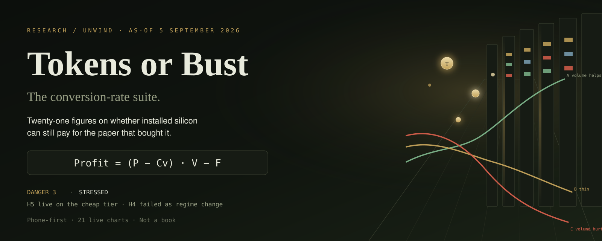
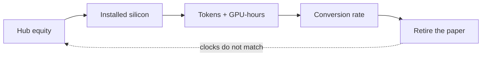

<p align="center">
  
</p>

<p align="center">
  
  
  
  
  
  
</p>

# Tokens or Bust

**Twenty-one figures on whether installed silicon can still pay for the paper that bought it.**

This is the phone-first visualization suite for the unwind pack. Hub equity funds silicon. Silicon sells tokens and GPU-hours. That conversion rate is supposed to retire the paper. The clocks do not match.

Turn the knobs. The identity moves. The filings stay still.

> Presence of a chart is not a short, not a hedge, and not an allocation. This is a process file.

---

## The identity

Every sketch in this suite is one formula, drawn until it hurts:

```text
Profit  =  (P − Cv) · V  −  F
```

| Symbol | Name | What it actually is |
| --- | --- | --- |
| **P** | Price | Dollars the seller receives for one million tokens. Realized price, not always the flagship list. |
| **Cv** | Variable cost | Extra cost of serving one more million tokens. Energy, markup, the part of the cluster that rises with volume. Training runs and chips already bought do not sit here. |
| **V** | Volume | Tokens sold in the month. Volume is not revenue. Revenue is P times V. |
| **F** | Fixed cost | Monthly cost that does not shrink when fewer tokens are sold. In the sketch, F is $900 million / month. That round number is **Hypothesis**. |
| **P − Cv** | Contribution margin | Cash left after serving one million tokens, before paying F. If this is negative, more volume deepens the hole. |

Three regimes, one slope:

| Path | Condition | What extra tokens do |
| --- | --- | --- |
| **A** green | P well above Cv | Volume helps. Extra tokens cover F. |
| **B** brass | Thin margin | Volume might help. You need a great deal of it. |
| **C** red | P below Cv | Volume hurts. The line never crosses zero by going right. |

Break-even volume is `F / (P − Cv)`. As P approaches Cv, that quotient has no ceiling.

---

## The loop



Cheap-tier token prices and neocloud H100 rental have already fallen. NVIDIA’s $105 billion residual-value cap is still on the books. The hub equity mark is intact. **Danger 3 · Stressed.**

---

## Five claims, scored in public

| Id | Claim | Now |
| --- | --- | --- |
| **H1** Index concentration | An unwind shows up first as deconcentration and factor rotation, not a wipeout of the tape. | **Open, weakly live.** Mag7 reconstructed at ~33.6% of SPY on 4 Sep 2026. RSP still leads SPY. |
| **H2** Capex vs cash | 2026 hyperscaler capex does not generate incremental cash fast enough. The cycle turns when managements cut capex. | **Open, live on cash.** Four-name Q2 cash PPE / OCF ≈ 0.95. AMZN TTM FCF −$7.6B. Guides went **up** in July. |
| **H3** Financing architecture | The fragile object is the funding stack. Equity is the last print. | **Open.** NVDA residual-value cap $105B filed 17 Aug 2026. CoreWeave debt ~$35B, equity 42% off the high. No guarantee drawn. |
| **H4** Regime change | July–August 2026 was the start of a regime change. | **Fail as regime change.** No hyperscaler capex cut. NVDA data-center $89.0B, +117% YoY, 2.6% off the May high. |
| **H5** Conversion rate | Listed token prices and GPU rental are the cash installed chips actually produce. If that rate falls while residual-value guarantees stay large, the last generation has not paid for itself. | **Open, live on the cheap tier.** Luna cut 30 July still listed. H100 neocloud $3.71 vs hyperscaler $10.53. The $105B cap was filed *after* the cut. |

Figure 21 is empty on purpose. A rate card is not utilization. Until a first-class print of tokens sold or GPU-hours consumed exists, do not infer that cheaper tokens were “made up in volume.”

---

## Ten numbers, one screen

| Print | Value |
| --- | --- |
| Mag7 in SPY | 33.6% |
| Four-name capex / OCF | 0.95 |
| AMZN TTM FCF | −$7.6B |
| NVDA data-center YoY | +117% |
| NVDA residual-value cap | $105B |
| H100 neocloud / hyperscaler | $3.71 / $10.53 |
| Luna input after 30 Jul | $0.20 / 1M |
| CY2026 capex guides | 3 up / 0 down |
| CoreWeave vs 52-week high | −42% |
| RSP vs SPY, 3-month | +4.48 / +0.99 |

Tape close 4 September 2026. Cards and filings read 5 September 2026.

---

## What you can do with it

The original pack was twenty-one static PNGs and a long letter. This repo is that letter, rebuilt so it fits in a hand and moves when you touch it.

| Surface | What happens |
| --- | --- |
| **Cover** | The formula, the danger level, the three live claims. |
| **Play** | Six identity charts. Drag F, starting P, path-C variable cost, the price multiplier, volume growth, and the floor. Charts recompute on the glass. Share copies the knobs into the URL. |
| **Figures** | All 21, swipeable, each tagged **Measured**, **Hypothesis**, **Mixed**, or **Unscored**. |
| **Claims** | The loop, H1–H5, the ten-number panel. |

How to read a tag:

- **Measured** — a filing, an official API card, or a named published series.
- **Hypothesis** — the teaching sketch. Paths A/B/C are not three companies.
- **Mixed** — some of the ink is a print, some of it is adjacent tape.
- **Unscored** — the panel is empty because the print does not exist yet.

Phone-first by construction: one column, bottom nav, 44px targets, glossary in a drawer, share links that reopen the same knobs.

---

<br/>

# Technical notes

The rest of this file is the conventional README: stack, layout, identity math, data provenance, and how to run it.

## Stack

| Layer | Choice |
| --- | --- |
| App | TanStack Start (React 19 + TanStack Router, file-based) |
| Charts | Recharts |
| Knob state | Zustand, with URL-param persistence on `/play` |
| UI | Tailwind 4, Radix Slider, Vaul drawers |
| Identity | Fraunces + IBM Plex Sans / Mono, forest editorial palette |
| Auth / DB | Off. No accounts, no Neon, no per-user rows. |

Defaults for the sketch match `research/unwind/plots/generate_suite.py` as-of 2026-09-05.

## Repository layout

```text
src/
  routes/
    index.tsx            Cover
    play.tsx             Interactive identity
    figures.tsx          Figures layout (Outlet)
    figures.index.tsx    Gallery
    figures.$id.tsx      One figure, prev/next
    claims.tsx           Loop + H1–H5 + ten-number panel
  lib/
    identity.ts          Paths A/B/C, break-even, regimes
    knobs.ts             Zustand store + URL codec
    figures.ts           Catalog, captions, tags, chapters
    measured.ts          Token cards, rental, cash, tape, hub
    hypotheses.ts        H1–H5, danger, glossary, disclaimer
    palette.ts           Series colors (lockstep with styles.css)
  components/
    AppShell.tsx         Phone chrome, bottom nav
    FigureChart.tsx      Chart switch by figure id
    charts/              IdentityCharts, MeasuredCharts
    KnobRow.tsx          Hydration-safe sliders
    LoopDiagram.tsx      SVG circular-finance loop
    GlossarySheet.tsx    Vaul drawer
docs/
  hero.svg               README banner
```

Chapters in `FIGURES`: identity · prices · paper · cash · tape · hub.

## Identity model

`src/lib/identity.ts` walks `k.months` (default 25) for each path:

```text
P_m  = max(floor, p0 * pMul^m)
Cv_m = cv0 * cvMul^m
V_m  = v0 * vMul^m
rev  = (P * V) / 1e6          # dollars, because P is $ / million tokens
vc   = (Cv * V) / 1e6
profit = rev - vc - F         # F is already in millions of dollars / month
```

Play knobs that serialize to the URL:

| Query | Meaning | Default |
| --- | --- | --- |
| `F` | Fixed cost, $ millions / month | `900` |
| `p0` | Starting P, $ / MTok | `4` |
| `cvC` | Path C variable cost | `1.3` |
| `pMulC` | Path C monthly price multiplier | `0.85` |
| `vMulC` | Path C monthly volume growth | `1.18` |
| `floorC` | Path C price floor | `0.35` |

Example: `/play?F=900&p0=4&cvC=1.3&pMulC=0.85&vMulC=1.18&floorC=0.35`

Play charts (hypothesis): `01` peak revenue, `05` P&amp;L, `06` GPU-hour, `07` mix, `02` regime, `04` break-even.

## Measured series

Static snapshots in `src/lib/measured.ts`. Not a live feed.

| Series | Source in the pack |
| --- | --- |
| Official API cards (fig 08–10) | First-party pricing pages read 2026-09-05. Blend is 3 input : 1 output, a convention, not a filing. |
| July cheap-tier cut | OpenAI first-party, 2026-07-30. Luna −80% (1.00/6.00 → 0.20/1.20). Terra −20% (implied prior 2.50/15.00). |
| GPU rental (fig 11) | CCIR guaranteed on-demand, 2026-09-04 07:30 ET, US &amp; EU. Interruptible rates are not drawn. |
| Residual-value cap (fig 12) | NVDA 8-K 2026-08-17 / 10-Q. SB Energy cap $105B; AI-cloud land/power/shell $3.5B. Do not divide 105B by 3.71. |
| Circular book (fig 13) | Filings and IR. Announced ≠ funded ≠ guaranteed ≠ revenue. Do not sum the bars. |
| Cash vs capex (fig 14–16) | Company FCF definitions differ. AMZN FCF is TTM; ORCL is full FY26; others are the cited quarter. |
| Tape (fig 17–19) | TradeSmith SPY holdings 2026-09-04; ETF.com early September; CoreWeave equity/debt measured, CDS hypothesis-adjacent. |
| Hub (fig 20) | NVDA 10-Q Q2 FY27. Data Center $89.023B, +117% YoY, +18% QoQ, company GM 75.0%. |
| Volume (fig 21) | Empty. Kill condition for closing H5 includes a primary volume offset. |

## Scripts

```sh
npm install
npm run dev          # Vite, 0.0.0.0:8080
npm run typecheck
npm run build
```

No database to migrate for this app. `db:migrate` exists because the scaffold ships it; the suite does not use it.

## Provenance

Repackaged from the static letter and PNGs in [`zfifteen/micro-hedge-fund` · `research/unwind/plots`](https://github.com/zfifteen/micro-hedge-fund/tree/main/research/unwind/plots). Captions, tags, and as-of stamps are carried forward. The interactive identity is a live recompute of that sketch, not a new claim.

## License and use

Research notebook. Not investment advice. If you fork it, keep the Measured / Hypothesis tags intact — mixing them is how this pack lies.
